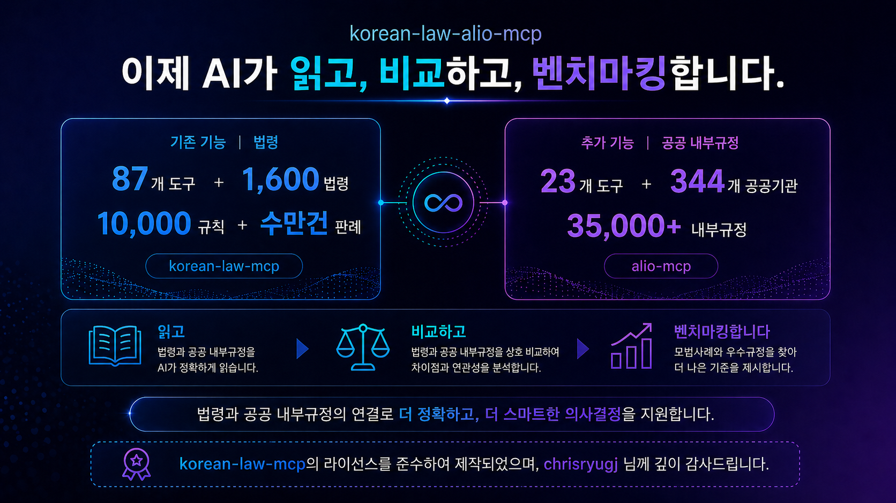

# Korean Law ALIO MCP

[](https://www.npmjs.com/package/korean-law-alio-mcp)
[](https://modelcontextprotocol.io)
[](./LICENSE)
[](./docs/API.md)
[](#-alio-공공기관-규정-fork-의-차별점)

---

국가법령정보센터와 알리오의 공공기관 내부규정을 검색·비교·분석하는 MCP 입니다.

법제처 87개 + ALIO 공공기관 규정 23개 총 110개 MCP 도구가 분석을 합니다.

1,600 법률, 10,000 행정규칙, 수만건 판례, 344개 공공기관 35,000 내부규정을 검색하고 비교 및 분석한 결과를 AI에게 주어 좋은 답변을 만들도록 도와줍니다.

본 프로젝트는 [chrisryugj/korean-law-mcp](https://github.com/chrisryugj/korean-law-mcp) 에서 파생되어 만들어 졌습니다.

[English](./README-EN.md)



---

## 만든 이유

전체 법령에 대해서 [korean-law-mcp](https://github.com/chrisryugj/korean-law-mcp) 의 도움으로 공공기관의 업무처리에 도움이 많이 되고 있습니다. 다시 한번 [chrisryugj](https://github.com/chrisryugj) 님께 감사드립니다.

여기에 공공기관의 내부규정까지 활용되면 더욱 큰 효과가 있을 것이라 생각되었습니다. 그래서 [ALIO](https://alio.go.kr/) 의 공공기관 내부규정 데이터를 참고해서 추가 개발을 하게 되었습니다.

법에 대한 접근이 어려운 사람들과 내부규정 관리로 고생하는 전국의 공공기관 직원들에게 도움이 되었으면 좋겠습니다.

---

## v1.0.0 — 공공기관 규정과 법제처 법령을 한 번에

원작 87개 법제처 도구 위에 **ALIO 공공기관 23개 + 두 영역을 잇는 연계 도구 3개** 를 통합 — 110개 도구가 1.27GB 데이터 (법제처 + 35,000건 공공기관 내부규정) 를 자연어로 검색·비교·분석.

### 추가 개발 사항

- **ALIO 23개 도구** — 344개 공공기관 35,000건 내부규정 통합 (kordoc 통합 파서로 HWP/HWPX/PDF/XLSX 자동 변환, on-demand 디스크 읽기)
- **공공기관 규정과 법제처 법령을 잇는 연계 도구 3종**
  - 공공기관 규정에서 인용된 상위 법령 자동 추출 + 법제처에서 각 법령 정보 자동 조회
  - 법제처 법령을 입력하면, 그 법령을 근거로 삼는 공공기관 규정을 전국에서 역검색
  - 단일 규정 안에서 조문끼리 어떻게 인용·참조하는지 자동 분석
- **자연어 라우팅** — 정식 기관명 자동 lookup (institutions.json 동기 로드), 두 영역 양쪽으로 자동 분기
- **API 키 인증실패 명확한 안내** — 12개 fetch 사이트 일괄 통합, IP/도메인 화이트리스트 차단 시 등록 페이지 안내
- **셋업 wizard** — `npx korean-law-alio-mcp setup` (API 키 → 운영 모드 → 클라이언트 다중 선택 → 설정 자동 등록)
- **fly.io 원격 배포** — `https://korean-law-alio-mcp.fly.dev` (110개 도구 + ALIO 데이터 mirror, best-effort 갱신)
- **CLI 표면 정리** — `list`/`help`/`--category`/`explain`/REPL + 자연어 bare-query
- **168 cases 테스트 스위트** — build 6 + router 13 + cli 23 + alio 39 + law 87 (`npm test`)
- **라이선스 위생** — 4개 파일 clean-room 재작성, BSL/Source-Available 코드 0

### 예시 — 두 영역을 잇는 자연어 질의

```
"OO진흥원 인사규정과 관련된 상위 법령을 알려줘"
```

→ AI 가 자연어 질의를 받으면 자동으로 다음을 수행:

- 해당 기관의 인사규정 본문을 분석해 인용된 상위 법령을 자동 추출
- 추출된 각 법령의 식별자를 법제처 OpenAPI 에서 자동 조회해 첨부
- 같은 기관의 내부 상위규정도 함께 매칭

결과 예시:

> "인사규정 본문에서 약 10여 건의 상위 법령 인용을 찾았습니다 (예: 인사·근로 관련 일반 법령, 안전·보건 관련 법령, 양성평등 관련 법령 등). 각 법령의 식별자가 첨부되어 후속 조회 가능. 같은 기관의 내부 상위규정도 함께 매칭되었습니다."

```
"OO공단의 OOO지침이 근로기준법을 준수하는지 검토해줘"
```

→ AI 가 자연어 질의를 받으면 자동으로 다음을 수행:

- 35,000건 공공기관 규정 본문에서 해당 법령 (예: 근로기준법) 인용 위치를 역검색
- 매칭된 지침의 인용 컨텍스트 (어느 조문이 어떻게 인용됐는지) 정리
- 기관별 그룹으로 표시

결과 예시:

> "여러 공공기관 지침에서 해당 법령 인용 사례가 검출되었습니다. 각 지침이 어느 조문을 어떻게 인용하는지 비교해, 자기 기관 지침의 준수 수준을 검토할 수 있습니다."

**공공기관 컴플라이언스 검토, 감사, 정책 분석에서 상위 법령까지 한 번에 추적**.

---

## 설치 및 사용법

### 0단계: API 키 발급 (무료, 1분)

모든 방법에 공통으로 필요한 **법제처 Open API 인증키(OC)** 를 먼저 발급받으세요.

1. [법제처 Open API 신청 페이지](https://open.law.go.kr/LSO/openApi/guideResult.do) 접속
2. 회원가입 후 로그인
3. "Open API 사용 신청" 버튼 클릭
4. 신청서 작성 → **인증키(OC)** 발급 (이메일 ID 형식)

> 아래 모든 예시의 `your-api-key-here` 는 placeholder — 본인 발급 키로 교체하세요. ([`.env.example`](./.env.example) 와 동일 컨벤션)

### 방법 1: Claude Code 플러그인 — 한 줄 설치

본인 API 키를 먼저 환경변수로 export 해두면 설치 시 자동 주입됩니다.

```bash
export LAW_OC=your-api-key-here   # ~/.zshrc 또는 ~/.bashrc 에 추가하면 영구 적용
```

이후 Claude Code 안에서:

```
/plugin marketplace add scvcoder/korean-law-alio-mcp
/plugin install korean-law-alio@korean-law-alio-marketplace
```

설치 후 자동으로 `npx -y korean-law-alio-mcp` 가 실행되며 `LAW_OC` 가 전달됩니다. 별도 설정 파일 편집 불필요.

### 방법 2: Claude.ai 웹에서 바로 사용 (설치 없음) 가장 간편

[claude.ai](https://claude.ai) 에서 커스텀 커넥터 추가. Claude Pro/Max/Team/Enterprise 요금제 필요 (Free는 커넥터 1개만 가능).

**커넥터 추가 방법**:

1. claude.ai 로그인
2. 사이드바 하단 본인 이름 → "설정" → "커넥터"
3. "커스텀 커넥터" 영역 → "커스텀 커넥터 추가"
4. 아래 입력 (`your-api-key-here` 는 본인 키로 교체):
   - **이름**: `korean-law-alio` (자유)
   - **URL**: `https://korean-law-alio-mcp.fly.dev/mcp?oc=your-api-key-here`
5. "추가" → 등록 완료

**도구 활성화 (중요)**: 등록한 커넥터 "구성" 클릭 → 도구 목록에서 **모든 도구를 "항상 사용"** 으로 설정. 매번 승인 없이 AI가 바로 호출 가능.

이제 채팅에서 자연어로:

```
"근로기준법 제74조 알려줘"                              → 법제처 87개 도구
"○○진흥원 인사규정 알려줘"                              → ALIO 23개 도구
"○○진흥원 감사규정과 관련된 상위법령은 뭐니?"          → 규정→법령 연계
"근로기준법과 OO공단의 인사규정의 관계는 어떻게 되니?"  → 법령→규정 역검색
"공공기관 휴직 규정 비교해줘"                            → ALIO 기관간 토픽 비교
```

> ALIO 데이터는 운영자가 주기적으로 갱신하지만, ALIO에서 별도 API를 제공하지 않아 실시간 최신 유지는 어렵습니다 (주기적 업데이트 예정).

### 방법 3: AI 데스크톱 앱에서 사용 (Claude Desktop · Cursor · Windsurf)

설정 파일에 아래 내용 추가:

```json
{
  "mcpServers": {
    "korean-law-alio": {
      "url": "https://korean-law-alio-mcp.fly.dev/mcp?oc=your-api-key-here"
    }
  }
}
```

**설정 파일 위치**:

| 앱 | macOS | Windows |
|---|---|---|
| Claude Desktop | `~/Library/Application Support/Claude/claude_desktop_config.json` | `%APPDATA%\Claude\claude_desktop_config.json` |
| Cursor | `<프로젝트>/.cursor/mcp.json` | `<프로젝트>/.cursor/mcp.json` |
| Windsurf | `<프로젝트>/.windsurf/mcp.json` | `<프로젝트>/.windsurf/mcp.json` |

이미 다른 MCP 서버가 설정되어 있다면 `"mcpServers": { ... }` 안에 `"korean-law-alio": { ... }` 부분만 추가. 저장 후 앱 재시작.

### 방법 4: 내 컴퓨터에 직접 설치 (오프라인 가능)

인터넷 없이 쓰고 싶거나, 원격 서버를 거치지 않으려면 직접 설치할 수 있습니다.

**사전 준비:** Node.js 버전 20 이상.

**자동 설치 (추천):**

```bash
npx korean-law-alio-mcp setup
```

설치 마법사가 API 키 입력 → AI 클라이언트 선택 → 설정 파일 자동 등록까지 한 번에 처리합니다.
Claude Desktop, Claude Code, Cursor, VS Code, Windsurf 를 지원합니다.

**수동 설치:**

```bash
npm install -g korean-law-alio-mcp
```

AI 앱 설정 파일에 아래 내용을 추가하세요 (`your-api-key-here` 를 본인 인증키로 바꾸세요):

```json
{
  "mcpServers": {
    "korean-law-alio": {
      "command": "korean-law-alio-mcp",
      "env": {
        "LAW_OC": "your-api-key-here"
      }
    }
  }
}
```

**ALIO 데이터 준비** — 자기 PC 에서 ALIO 도구를 쓰려면 데이터가 있어야 합니다. 두 방법 중 하나로 준비하세요.

#### (방법 1) 운영자 mirror 사용 (5-15분, 추천)

미리 수집해둔 데이터를 다운로드. 약 200MB 압축본 → 풀면 1.27GB.

**Mac, Linux:**
```bash
curl -L -o alio-data.tar.gz https://github.com/scvcoder/korean-law-alio-mcp/releases/latest/download/alio-data.tar.gz
tar -xzf alio-data.tar.gz -C data/
```

**Windows (PowerShell):**
```powershell
Invoke-WebRequest -Uri https://github.com/scvcoder/korean-law-alio-mcp/releases/latest/download/alio-data.zip -OutFile alio-data.zip
Expand-Archive -Path alio-data.zip -DestinationPath data\
```

#### (방법 2) 직접 수집 (6-12시간)

ALIO 공시에서 344개 공공기관 35,000건 규정을 직접 수집. 최신 데이터를 본인이 통제 가능.

스캔 PDF · HWP 3.0 같은 일부 특수 케이스 변환을 위해 OS 시스템 도구 설치 권장 (없어도 일반 케이스는 정상 처리, 특수 케이스만 건너뜀).

> HWP/HWPX/PDF 통합 파서(`kordoc`)는 `npm install` 시 자동 설치됩니다. 별도 설치 불필요하며, kordoc 으로 파싱이 어려운 부분은 `docling` · `tesseract` · `tesseract-lang` · `libreoffice` 를 사용하여 추가로 파싱합니다.

**macOS:**
```bash
brew install docling tesseract tesseract-lang libreoffice
```

**Linux (Ubuntu/Debian):**
```bash
sudo apt install tesseract-ocr tesseract-ocr-kor libreoffice
pip install docling
```

**Windows:**
Node.js 만 있어도 수집 자체는 동작 (특수 케이스는 건너뜀).
Node.js 가 없다면 [nodejs.org](https://nodejs.org) 에서 LTS 버전(20 이상) `.msi` 다운로드 후 설치.

파싱에 필요한 프로그램들이 설치가 완료되었으면 아래 명령으로 수집합니다.

수집 명령:
```bash
npm run alio:sync                   # 전체 344개 기관 (6-12시간)
npm run alio:sync -- --only C0xxx   # 단일 기관만 (apbaId 4자리, 수 분)
npm run alio:sync -- --resume       # 실패한 기관만 재시도
```

수집된 데이터는 `data/alio/` 에 저장 (약 1.27GB).

---

앱을 재시작하면 완료!

### 방법 5: 터미널(CLI)에서 직접 사용

개발자라면 터미널에서 직접 법령·공공기관 규정을 검색할 수 있습니다.

```bash
# 설치
npm install -g korean-law-alio-mcp

# 인증키 설정 (your-api-key-here 를 본인 키로 바꾸세요)
export LAW_OC=your-api-key-here     # Mac/Linux
set LAW_OC=your-api-key-here        # Windows CMD
$env:LAW_OC="your-api-key-here"    # Windows PowerShell

# 사용 예시
korean-law-alio "민법 제1조"                                # 법제처 자연어
korean-law-alio "OO진흥원 인사규정"                         # ALIO 자연어
korean-law-alio "OO진흥원 인사규정과 관련된 상위 법령"      # 두 영역 연계
korean-law-alio "공공기관 휴직 규정 비교해줘"                # ALIO 기관간 비교
korean-law-alio search_law --query "관세법"                 # 도구 직접 호출
korean-law-alio list                                        # 전체 110개 도구 목록
korean-law-alio list --category ALIO                        # 카테고리별 (ALIO/판례/법령검색 등)
korean-law-alio help search_law                             # 도구별 도움말
korean-law-alio                                             # REPL (대화형)
```

> ALIO 도구는 **사용자 자연어 그대로** — 비교 대상 기관을 환경변수에 박아두지 않음. "A·B·C 기관과 비교", "랜덤", "전체" 같이 자유롭게 표현하면 LLM 이 알아서 호출.

### API 키 전달 방법 정리

여러 방법으로 인증키를 전달할 수 있습니다. 위에서부터 우선 적용됩니다:

| 방법 | 사용법 | 용도 |
|------|--------|------|
| URL에 포함 | 주소 끝에 `?oc=내키` | 웹 클라이언트에서 가장 간편 |
| HTTP 헤더 | `apikey: 내키` | 프로그래밍으로 연동할 때 |
| 환경변수 | `LAW_OC=내키` | 로컬 설치(방법 3, 4) |
| 도구 파라미터 | `apiKey: "내키"` | 특정 요청만 다른 키 쓸 때 |

---

## 사용 예시

### 법제처 도구 — 법령·판례·해석례

```
"민법 제1조 알려줘"
→ AI 가 법령 검색 → 해당 조문 자동 조회

"음주운전 처벌 기준"
→ AI 가 관련 법령 + 판례 + 해석례를 자동으로 종합 분석

"근로기준법 제74조 해석례"
→ AI 가 해당 조문 + 정부 해석례를 자동 매칭
```

### ALIO 공공기관 규정 도구

```
"OO진흥원 인사규정 보여줘"
→ AI 가 정식 기관명을 자동 매칭 → 해당 기관 규정 목록 표시

"공공기관 휴직 규정 비교해줘"
→ AI 가 수집된 공공기관 전체에서 휴직 관련 규정을 자동 비교

"우리 기관에 없는 동종 기관 규정"
→ AI 가 동종 기관 보유 규정 - 자기 기관 보유 규정 = 벤치마킹 후보 자동 추출
```

### 법제처와 ALIO 를 연결하는 도구

공공기관 내부규정은 본질적으로 상위 법제처 법령에서 위임/근거를 받습니다. 두 영역을 잇는 자연어 질의도 자동 처리:

```
"OO진흥원 인사규정과 관련된 상위 법령을 알려줘"
→ AI 가 규정 본문에서 인용된 상위 법령을 자동 추출
   + 법제처에서 각 법령 정보를 자동 조회

"OO공단의 OOO지침이 근로기준법을 준수하는지 검토해줘"
→ AI 가 35,000건 공공기관 규정에서 해당 법령 인용 위치를 역검색
   → 매칭된 지침의 인용 컨텍스트 + 기관별 그룹 표시
```

---

## 도구 구조 (110개)

| 구분 | 개수 | 비고 |
|------|------|------|
| 법령·행정규칙·자치법규 | 16 | 검색·조회·비교·연계 |
| 판례·해석례 | 7 | 대법원·법령해석례 |
| 위원회 결정문 | 10 | 헌재·공정위·개인정보위·노동위·권익위 |
| 조세심판·관세·조약·영문 | 8 | 도메인별 결정문/원문 |
| 학칙·공사공단·공공기관 (법제처) | 6 | 공공·교육 영역 |
| 별표·체계·통계·이력·용어사전 등 부가 | 24 | |
| 체인 도구 (자동 종합) | 8 | 종합리서치·법체계·처분근거·쟁송·개정추적·조례비교·절차상세·문서검토 |
| 문서분석·유틸 | 8 | 조문번호 변환, 약칭 사전 등 |
| ALIO 공공기관 규정 | 22 | 검색·조회·비교·벤치마킹·타임라인·통계 + 두 영역 연계 3종 |
| ALIO 체인 도구 | 1 | 기관 종합 벤치마킹 |
| **합계** | **110** | |

전체 도구 상세 (이름·파라미터·예시) 는 [`docs/API.md`](./docs/API.md) 참고.

---

## 주요 특징

- **110개 도구 통합** — 법제처 87 + ALIO 공공기관 23
- **두 영역 연계** — 공공기관 규정의 인용 법령 자동 추출 + 상위법 기반 ALIO 역검색 + 조문간 인용 그래프
- **자연어 라우팅** — 정식 기관명 자동 매칭 (수집된 344개 기관), 두 영역 자동 분기
- **MCP + CLI** — Claude Desktop·Cursor·Windsurf 에서도, 터미널에서도 같은 도구 사용
- **법률 도메인 특화** — 약칭 자동 인식 (`화관법` → `화학물질관리법`), 조문번호 변환 (`제38조` ↔ `003800`), 위임 구조 시각화
- **별표·별지서식 본문 추출** — HWPX·HWP·PDF·XLSX·DOCX 자동 변환 (kordoc 엔진)
- **원격 + 로컬 모드** — `https://korean-law-alio-mcp.fly.dev` 즉시 사용 OR 자기 PC 에 데이터 보관 (`npm run alio:sync`)
- **자동 설치 마법사** — `npx korean-law-alio-mcp setup`
- **검증** — 168 cases 자동 테스트 (`npm test` — 빌드·라우터·CLI·ALIO·법제처)
- **라이선스** — MIT

---

## 환경 변수

| 변수 | 필수 | 용도 |
|------|------|------|
| `LAW_OC` | ✅ | 법제처 OpenAPI 신청자의 오픈 API 인증키 |

전체 변수 + 예시는 [`.env.example`](./.env.example) 참고.

---

## 문서

| 문서 | 설명 |
|------|------|
| [`README.md`](./README.md) | 한글 README (현재 문서) |
| [`README-EN.md`](./README-EN.md) | 영문 README |
| [`docs/API.md`](./docs/API.md) | 110개 도구 레퍼런스 |
| [`LICENSE`](./LICENSE) | MIT |
| [`NOTICE`](./NOTICE) | 사용한 외부 라이브러리·데이터의 출처와 라이선스 표기 |

---

## 감사의 말

본 프로젝트는 다음 분들 덕분에 가능했습니다:

- chrisryugj 님 — [korean-law-mcp](https://github.com/chrisryugj/korean-law-mcp), [kordoc](https://github.com/chrisryugj/kordoc) 프로젝트를 만드시지 않았으면 이 프로젝트는 시작될 수 없었습니다. 진심으로 감사드립니다.
- jkg 님 — ALIO 공공기관 내부규정을 통합해 보자는 아이디어를 주셔서 감사합니다.

---

## 라이선스

[MIT](./LICENSE)

---

<sub>Made by <a href="https://github.com/scvcoder">scvcoder</a></sub>
